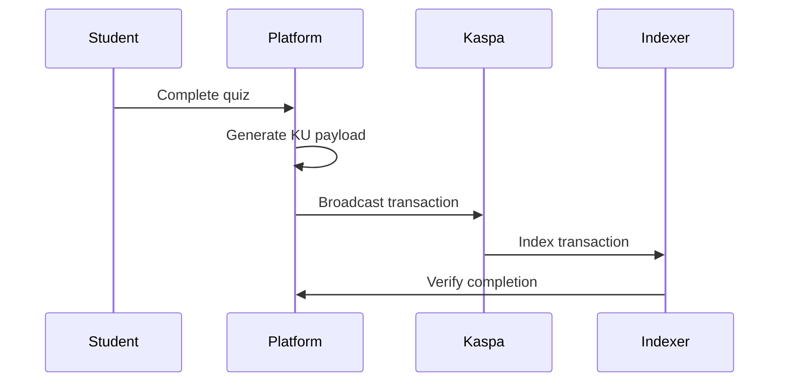

# KU Protocol Specifications

## Overview

KU Protocol defines a standardized format for recording educational achievements on the Kaspa blockchain. All data is stored in transaction payloads, enabling verifiable, tamper-proof records of learning progress.

## Protocol Format

All KU Protocol messages follow this structure:

```
ku:{version}:{type}:{data_fields}
```

### Components

| Component | Description |
|-----------|-------------|
| `ku` | Protocol identifier prefix |
| `version` | Protocol version (currently `1`) |
| `type` | Message type (`quiz`, `cert`, `prog`) |
| `data_fields` | Colon-delimited type-specific data |

## Message Types

### Quiz Completion Proof (`quiz`)

Records verifiable quiz completion with score and content hash.

**Format:**
```
ku:1:quiz:{wallet_address}:{course_id}:{lesson_id}:{score}:{max_score}:{timestamp}:{content_hash}
```

**Field Descriptions:**
- `wallet_address`: Kaspa address of the student (e.g., `kaspa:qz...`)
- `course_id`: Unique identifier for the course
- `lesson_id`: Unique identifier for the lesson/quiz
- `score`: Number of correct answers
- `max_score`: Total number of questions
- `timestamp`: Unix timestamp in milliseconds
- `content_hash`: SHA-256 hash of answers for verification (first 16 chars)

**Example:**
```
ku:1:quiz:kaspa:qz7vy4v5dwmua4z8rkvqe8zl7fgh6jmqwpxxnvkpqa8gvnxn5ldxuswjmvr7:btc-vs-kas:lesson-1:8:10:1704067200000:a3f2b8c9d4e5f6a7
```

**Content Hash Calculation:**
```typescript
const answerString = answers.join(",");
const hashInput = `${lessonId}:${answerString}:${score}`;
const contentHash = sha256(hashInput).slice(0, 16);
```

### Certificate Claim (`cert`)

Records a diploma or certificate claim request.

**Format:**
```
ku:1:cert:{wallet_address}:{certificate_type}:{timestamp}:{eligibility_hash}
```

**Field Descriptions:**
- `wallet_address`: Kaspa address of the student
- `certificate_type`: Type of certificate (`diploma`, `course-completion`)
- `timestamp`: Unix timestamp in milliseconds
- `eligibility_hash`: Hash of completed courses for verification

**Example:**
```
ku:1:cert:kaspa:qz7vy4v5dwmua4z8rkvqe8zl7fgh6jmqwpxxnvkpqa8gvnxn5ldxuswjmvr7:diploma:1704067200000:b4e5f6a7c8d9e0f1
```

### Progress Marker (`prog`)

Records lesson or module completion progress.

**Format:**
```
ku:1:prog:{wallet_address}:{course_id}:{lesson_id}:{completion_type}:{timestamp}
```

**Field Descriptions:**
- `wallet_address`: Kaspa address of the student
- `course_id`: Unique identifier for the course
- `lesson_id`: Unique identifier for the lesson
- `completion_type`: Type of completion (`view`, `complete`, `quiz-pass`)
- `timestamp`: Unix timestamp in milliseconds

**Example:**
```
ku:1:prog:kaspa:qz7vy4v5dwmua4z8rkvqe8zl7fgh6jmqwpxxnvkpqa8gvnxn5ldxuswjmvr7:btc-vs-kas:lesson-1:complete:1704067200000
```

## Transaction Structure

KU Protocol data is embedded in Kaspa transaction payloads:

1. Protocol string is UTF-8 encoded
2. UTF-8 bytes are hex-encoded
3. Hex string is placed in transaction payload field



## Verification

### On-Chain Verification

1. Fetch transaction by hash
2. Extract payload from transaction
3. Hex-decode payload to UTF-8 string
4. Parse KU protocol fields
5. Verify content hash matches expected data

### Hash Verification

```typescript
function verifyQuizHash(
  lessonId: string,
  answers: number[],
  score: number,
  expectedHash: string
): boolean {
  const answerString = answers.join(",");
  const computedHash = sha256(`${lessonId}:${answerString}:${score}`).slice(0, 16);
  return computedHash === expectedHash;
}
```

## Bitmask System

For efficient transaction monitoring, KU Protocol includes a bitmask system:

### Layout (16-bit integer)

| Bits | Purpose | Values |
|------|---------|--------|
| 0-2 | Transaction Type | 0=Unknown, 1=Quiz, 2=QA_Q, 3=QA_A, 4=Reward, 5=Certificate |
| 3-5 | Status | 0=Pending, 1=Confirmed, 2=Failed, 3=Expired |
| 6-7 | Score Range | 0=Fail(<70%), 1=Pass(70-84%), 2=Excellent(85-99%), 3=Perfect(100%) |
| 8-15 | Flags | HAS_PAYLOAD, VERIFIED, REWARD_CLAIMED, NFT_MINTED, etc. |

### Usage

```typescript
// Create bitmask for a confirmed quiz with perfect score
const mask = createTxBitmask({
  type: 'QUIZ',
  status: 'CONFIRMED',
  scorePercent: 100,
  flags: ['HAS_PAYLOAD', 'VERIFIED', 'FIRST_ATTEMPT']
});

// Filter transactions by criteria
const isVerifiedQuiz = matchesTxMask(mask, {
  type: 'QUIZ',
  status: 'CONFIRMED',
  hasFlag: 'VERIFIED'
});
```

## Payload Size Limits

- Maximum payload size: 2048 bytes (conservative)
- Maximum content length: 500 characters for Q&A content
- Kaspa supports up to ~84KB but we stay conservative for efficiency

## Ecosystem Integration

KU Protocol works alongside:

| Protocol | Purpose | Prefix |
|----------|---------|--------|
| KU Protocol | Educational achievements | `ku:` |
| K Protocol | Public microblogging/Q&A | `k:` |
| Kasia Protocol | Encrypted P2P messaging | `ciph_msg:` |
| KRC-721 | NFT certificates | (inscription format) |

## Best Practices

1. **Always verify on-chain**: Don't trust database records, verify against blockchain
2. **Use content hashes**: Enable independent verification of quiz results
3. **Include timestamps**: Allow chronological ordering and staleness detection
4. **Handle address formats**: Kaspa addresses contain colons, use reverse indexing for parsing

## Version History

| Version | Date | Changes |
|---------|------|---------|
| 1 | 2024-01 | Initial protocol specification |
